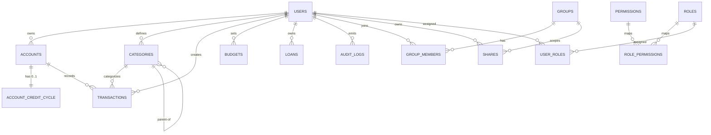

# Finance App – ERD (Mermaid)

> ERD

```mermaid
erDiagram
    USERS ||--o{ ACCOUNTS : "owns"
    USERS ||--o{ CATEGORIES : "defines"
    USERS ||--o{ TRANSACTIONS : "creates"
    USERS ||--o{ BUDGETS : "sets"
    USERS ||--o{ LOANS : "owns"
    USERS ||--o{ AUDIT_LOGS : "emits"

    ACCOUNTS ||--|| ACCOUNT_CREDIT_CYCLE : "has 0..1"
    ACCOUNTS ||--o{ TRANSACTIONS : "records"

    CATEGORIES ||--o{ TRANSACTIONS : "categorizes"
    CATEGORIES ||--o{ CATEGORIES : "parent-of"

    GROUPS ||--o{ GROUP_MEMBERS : "has"
    USERS  ||--o{ GROUP_MEMBERS : "joins"

    GROUPS ||--o{ SHARES : "scopes"
    USERS  ||--o{ SHARES : "owns"

    ROLES ||--o{ ROLE_PERMISSIONS : "maps"
    PERMISSIONS ||--o{ ROLE_PERMISSIONS : "maps"

    USERS ||--o{ USER_ROLES : "assigned"
    ROLES ||--o{ USER_ROLES : "assigned"
```